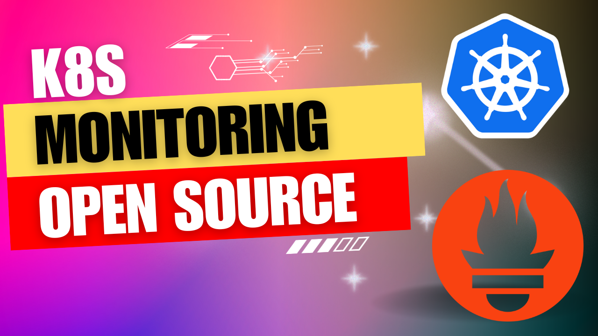

# Monitoring with Kubernetes series



  * Prometheus Operator (ServiceMonitor | PodMonitor | ScrapeConfig | ProbeMonitor | PrometheusRule)
  * Grafana
  * Alert Manager
  * PushGateway
  * Thanos
  * Loki


## Prerequisite

### Create kind cluster
https://kind.sigs.k8s.io/

```bash
kind create cluster --image kindest/node:v1.23.1 --config ./kind/prometheus-config.yaml
```

> "1 control plane node and 3 workers, kind config tuned to make it possible to run prometheus (kube-prometheus-stack) within"

### Install robot-shop
> "robot-shop is a sample microservice application which will be installed to kind k8s cluster and monitored with kube-prometeus-stack"

https://github.com/instana/robot-shop

```bash
kubectl create ns robot-shop
helm install robot-shop --namespace robot-shop ./robot-shop/helm
```

> "In this version I am using mongo-db image with tag 2.0.0 (latest version didn't worked with kind) and LoadBalancer type disabled for 'web-service'"

### Install kube-prometeus-stack (prometheus operator) to kind k8s cluster

```bash
helm install --wait --timeout 15m \
  --namespace monitoring --create-namespace \
  --repo https://prometheus-community.github.io/helm-charts \
  kube-prometheus-stack kube-prometheus-stack --values - <<EOF
kubeEtcd:
  service:
    targetPort: 2381
EOF
```

## Monitoring with k8s and open source series

### 1. [kube prometheus stack: install and overview of useful alerts and dashboards](kube-prometheus-stack-review.md)

### 2. [Prometheus Operator: Scrape metrics from your application](prometheus-operator-metrics.md)
  
  Prometheus Operator CRDs:
  * ServiceMonitor
  * PodMonitor
  * ScrapeConfig 
  * ProbeMonitor

### 3. [Prometheus Operator: Create alerts for your application ](prometheus-operator-alerts.md)
  Prometheus Operator CRDs:
  * PrometheusRule
